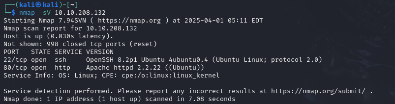
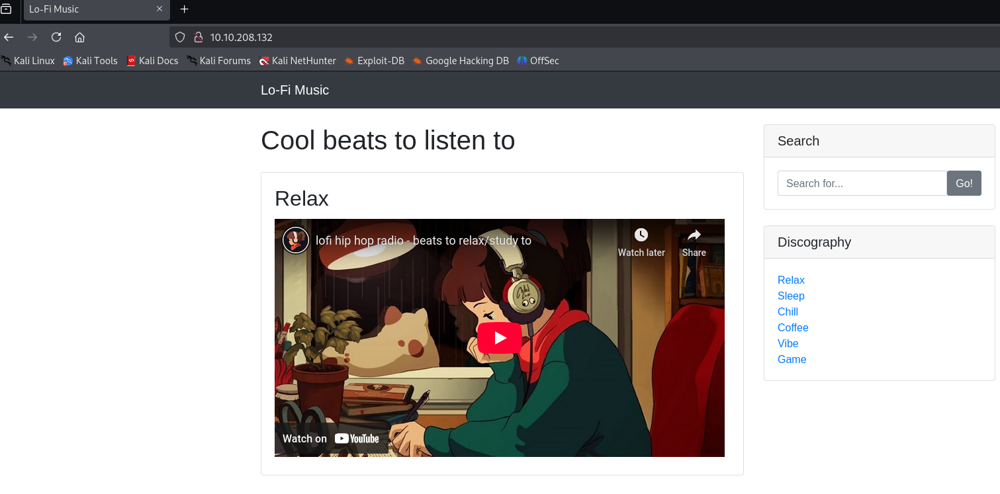
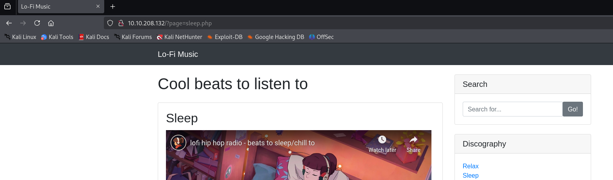

## Introduction  
This is a writeup of the Lo-Fi CTF room, on TryHackMe 

## 🕵️ Reconnaissance
** Tools Used: Nmap**

We start with an Nmap scan of the target

**Command Used:**
**Tag Explaination:**

**Results:**  
  

This reveals an SSH port and a webserver on port 80. Investigating the latter give us the following

  

It's a webpage, with different categories of music discography
Clicking onto these different categories does something interesting to the url

This tells us two things, 

## 🔍 Vulnerability Analysis
Explain the vulnerabilities identified, detailing how you analyzed the target.
## 💥 Exploitation
Outline the exploitation process, including commands, scripts, or techniques used.
## 🔐 Post-Exploitation
Discuss actions taken after gaining access — privilege escalation, maintaining access, etc.
## 🛡️ Mitigation
Recommend security measures to patch or prevent the vulnerability.
