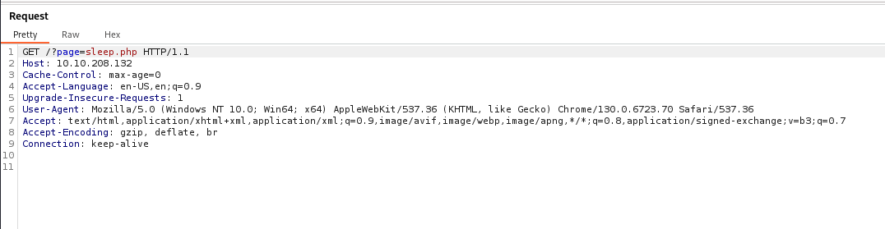
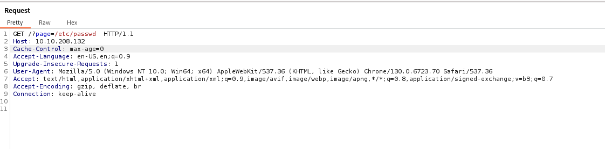
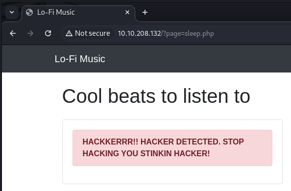

## Introduction  
This is a writeup of the Lo-Fi CTF room, on TryHackMe 

## 🕵️ Reconnaissance
** Tools Used: Nmap**

We start with an Nmap scan of the target

**Command Used:**
**Tag Explaination:**

**Results:**  
  

This reveals an SSH port and a webserver on port 80. Investigating the latter give us the following

  

It's a webpage, with different categories of music discography
Clicking onto these different categories does something interesting to the url

This shows the URL changing and referencing the respective PHP page for the category

## 🔍 Vulnerability Analysis
Given the changing URL parameters, it indicates the potential of a Local File Inclusion vulnerability. 
LFI is a security vulnerability that allows attackers to execute/access files by manipulating file pathing within a web application. If input isn't sanitised by the application, directory traversal is possible, and so an attacker may be able to access sensitive files they are not inteded to be able to access.

In this case, using Burp Suite to capture a request:

And then changing the address of the request

We are greeted with an interesting message...

## 💥 Exploitation
** Tools Used: Burp Suite**
Now we know the vulnerability to exploit, lets get to work.

Let's start by navigating upwards from our current directory, as we unsure of the exact structure of the target.
Appending "../" to our request goes up one level (out of our current directory)
After moving upwards a few levels, the following gives us what we are looking for:
../../../../../../etc/passwd

It gives us the contents of the /etc/passwd file

The description of the TryHackMe box states "find the flag in the root of the filesystem." 
So given that we know the location of /etc/passwd, we can adjust our request to:
../../../../../../flag.txt

And there we have it, the flag

## 🛡️ Mitigation
Recommend security measures to patch or prevent the vulnerability.
